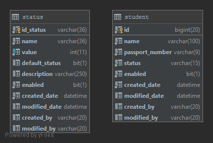

# Microservicio us-core-${artifactId}

En el microservicio desarrollado, se realizaran las operaciones básicas de 
administración de registros: creación, actualización y obtención (única y listado). Será 
determinado como un microservicio core debido a que contemplará procesos muy 
básicos con una lógica de negocio nula / inexistente. 

## Variables de Entorno
| Variable | Valor por Defecto Productivo | Descripcción | Ejemplos | Requerido |
| -------- | ----------------- |------------- | -------- | --------- |
| APP_PORT | 8080 | Puerto por defecto del Proyecto | 80, 8082 | No |
| APP_RELEASE | 0 | Número de liberación | 1, 2, 98| No |
| APP_ENVIRONMENT | dev | Variable que determina el entorno de la aplicación | dev, qa, uat y pro | No |
| LOGGER_DIR  | var/log/us        | Directorio de almacenamiento de log | /apps | Si |
## Diccionario de Datos
### ${artifactId}
| Atributo | Tipo | Descripcción | Ejemplos | llave |
| -------- | ----------------- | ------------- | -------- | --------- |
| id | texto(UUID) | Identificador del registro | 27dda180-2e8e-4ea9-991a-9aa548fc4f9e | PK |
| descriptión | texto | Descripción | Entidad nueva | - |
| enable | bit | Bandera que indica si el registro esta habilitado | true, flase | - |
| status | número | Determinar el estado de un comercio | 0, 1, 2, 3 , 4 | - |
| created_user | texto(UUID) | Identificador del Usuario Creación | 2e92ab71-a399-47a0-968d-4f05c827f4e8 | - |
| created_date | fechahora | Fecha y hora de la creación del registro | 2019-11-12 13:34:12.12321412 | - |
| last_modified_user | texto(UUID) | Identificador del último Usuario Modificación| 24d194da-07fb-433f-a3e5-34316f112c5a | - |
| last_modified_date | fechahora | Fecha y hora de la última actialización del registro | 2019-11-12 13:34:12.12321412 | - |

## Esquema de Base de datos


## Empezando

Estas instrucciones le permitirán obtener una copia del proyecto en funcionamiento en su máquina local para fines de desarrollo y prueba. Consulte la implementación para ver las notas sobre cómo implementar el proyecto en un sistema en vivo.

```
http://localhost:8080/login
user : user
password : mirar en la consola la password
```

```
http://localhost:8080
http://localhost:8080/swagger-ui.html
```

### Prerrequisitos

Qué cosas necesita para instalar el software y cómo instalarlo

```
mvn --version
```

### Instalación

Una serie paso a paso de ejemplos que le indican cómo ejecutar un entorno de desarrollo.

Di cuál será el paso

```
mvn clean install
```
Termine con un ejemplo de cómo sacar algunos datos del sistema o usarlos para una pequeña demostración.

## Ejecutando los test

Explicar cómo ejecutar las pruebas automatizadas para este sistema.

### Desglosar las pruebas

Explica qué pruebas y por qué

```
mvn test 
```

### Estilo de codificación

Explicar un poco sobre. editorconfig

## Despliegue

Azure DevOps

## Construir con

* [Maven](https://maven.apache.org/) - Gestionado de dependencias

## Versiones
| Versión | Fecha | Resumen |
| --- | --- | --- |
| 1.0.0  | 04/2019 | Pasarela de pagos en línea|

## Autores

* **Juan Developer** - *Trabajo inicial* - developer@intercorpretail.pe
